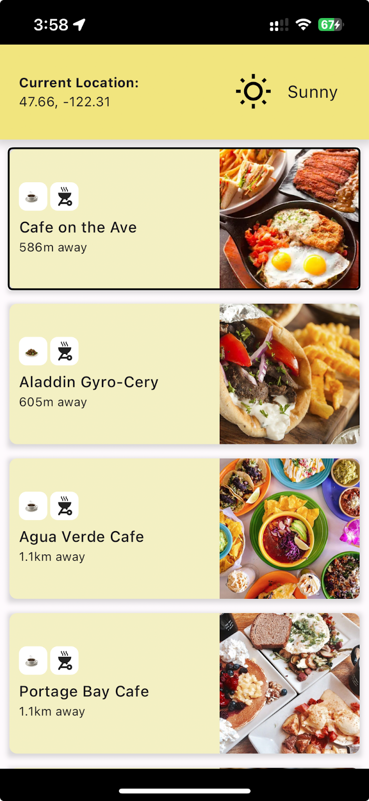

# Food Finder App

**App developed by Brian Yu for CSE 340 class at University of Washington**

This is an android (iOS not tested, but may work) food finder app (similar to barebones [Uber Eats](https://play.google.com/store/apps/details?id=com.ubercab.eats&hl=en_CA)). This project queries user's location using Flutter's [geolocator package](https://pub.dev/packages/geolocator) to determine distance from venues in real time. Venues displayed are fixed and scope is limited to select locations around University of Washington, Seattle.

Features:
- One-tab scrollable interface of available venues, sorted in order from nearest to furthest (from user location).
- Cuisine genre (rough) and patio availability as tags (little icons).
- Tapping on venue cards opens an external browser directly to the venue's website (if applicable).
- Weather and user location provided in the app bar (header).
- Nudging: venue sorting algorithm checks the weather prior to sorting and nudges locations with patios higher up the sort list if it's sunny.
- Accessibility: screen reader semantics.

This app serves more as a portal to browse locations before redirecting you elsewhere to refine your plans.

A brainstorm sketch can be found under `assets/` folder titled `food_finder_sketch.jpg`.

*All venue images are taken from their respective websites, listed in `venues.json`.*

## Resources Used

Comprehensive list of online resources and documentation used: 
- https://dart.dev/guides/libraries/futures-error-handling
- https://api.flutter.dev/flutter/dart-async/Future/then.html
- https://stackoverflow.com/questions/73352447/why-visual-studio-code-does-not-recognize-my-phone
- https://stackoverflow.com/questions/49713189/how-to-use-conditional-statement-within-child-attribute-of-a-flutter-widget-cen
- https://stackoverflow.com/questions/54783316/flutter-geolocator-package-not-retrieving-location
- https://developer.android.com/guide/topics/manifest/uses-permission-element
- https://pub.dev/packages/geolocator
- https://stackoverflow.com/questions/71110157/flutter-geolocator-returning-0-0
- https://api.flutter.dev/flutter/widgets/GridView-class.html
- https://api.flutter.dev/flutter/widgets/CustomScrollView-class.html
- https://api.flutter.dev/flutter/painting/TextStyle-class.html
- https://stackoverflow.com/questions/57777737/flutter-give-container-rounded-border
- https://www.dhiwise.com/post/unravel-the-dart-delay-function-in-flutter
- https://stackoverflow.com/questions/70098876/creating-a-dynamic-list-of-animated-containers-that-can-have-different-propertie
- https://stackoverflow.com/questions/43149055/how-do-i-open-a-web-browser-url-from-my-flutter-code
- https://pub.dev/packages/url_launcher
- https://docs.flutter.dev/packages-and-plugins/using-packages
- https://stackoverflow.com/questions/62265548/flutter-how-to-access-property-from-its-state-class
- https://api.flutter.dev/flutter/widgets/GestureDetector-class.html
- https://stackoverflow.com/questions/62067082/unhandled-exception-cannot-hit-test-a-render-box-with-no-size
- https://stackoverflow.com/questions/64416480/android-scroll-view-overlaps-other-views-below-it
- https://stackoverflow.com/questions/57777737/flutter-give-container-rounded-border
- https://api.flutter.dev/flutter/widgets/AspectRatio-class.html
- https://docs.flutter.dev/cookbook/design/fonts
- https://stackoverflow.com/questions/56321151/how-to-put-icon-on-string-in-flutter
- https://stackoverflow.com/questions/53141752/set-the-space-between-elements-in-row-flutter
- https://stackoverflow.com/questions/57130239/changing-aspect-ratio-of-image-in-flutter
- https://stackoverflow.com/questions/57304512/how-to-make-one-side-circular-border-of-widget-with-flutter
- https://stackoverflow.com/questions/51513429/how-to-do-rounded-corners-image-in-flutter
- https://stackoverflow.com/questions/58369317/flutter-customscrollview-did-not-scroll-full-length
- https://stackoverflow.com/questions/56981817/customscrollview-slivers-with-contents-in-sliverfillremaining-not-scrolling
- https://api.flutter.dev/flutter/widgets/Image-class.html
- https://api.flutter.dev/flutter/painting/BoxFit.html
- https://stackoverflow.com/questions/52227846/how-can-i-add-shadow-to-the-widget-in-flutter
- https://api.flutter.dev/flutter/material/SliverAppBar-class.html
- https://stackoverflow.com/questions/74378112/how-use-changenotifier-and-consumer-in-custom-flutter-app-bar
- https://stackoverflow.com/questions/56549093/how-to-change-the-box-shadow-height-width-and-opacity-in-flutter
- https://www.dhiwise.com/post/creative-ways-to-enhance-ui-with-flutter-box-shadow
- https://www.geeksforgeeks.org/flutter-boxshadow-widget/
- https://stackoverflow.com/questions/57203505/flutter-stretch-columns-to-full-screen-height
- https://stackoverflow.com/questions/50554110/how-do-i-center-text-vertically-and-horizontally-in-flutter
- https://stackoverflow.com/questions/66516125/prevent-changing-text-size-based-device-screen-size-flutter
- https://stackoverflow.com/questions/68284367/row-mainaxisalignment-not-working-with-fittedbox
- https://api.flutter.dev/flutter/dart-core/num/abs.html

Thank you to Jacklyn Cui for auditing the app.
